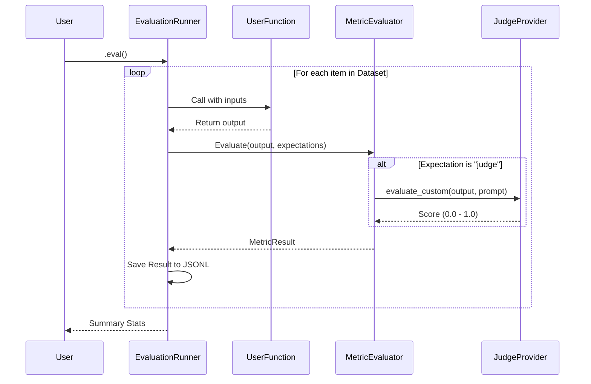

# Architecture Deep Dive

This document explains the internal architecture of Vald8, the design decisions behind it, and how the components interact.

## Core Components

Vald8 is composed of three main layers:
1.  **The Decorator Layer** (`decorator.py`): The entry point for the user.
2.  **The Orchestration Layer** (`EvaluationRunner`): Manages the flow of data.
3.  **The Evaluation Layer** (`metrics.py`, `judges.py`): Performs the actual validation.

### 1. The Decorator Layer (`@vald8`)

The `@vald8` decorator is a wrapper that intercepts calls to the user's function.

*   **Why Decorators?** We chose decorators because they are non-intrusive. They allow users to "tag" functions for evaluation without modifying the function's internal logic.
*   **Mechanism**: When the decorated function is called, Vald8 checks if it's being run in "evaluation mode" (triggered by `function.eval()`). If so, it bypasses normal execution and hands control to the `EvaluationRunner`.

### 2. The Orchestration Layer (`EvaluationRunner`)

The `EvaluationRunner` is the heart of the system. It is responsible for:
*   **Loading Data**: It reads the JSONL dataset line by line.
*   **Executing the Function**: It calls the user's original function with inputs from the dataset.
*   **Collecting Results**: It captures the output and passes it to the evaluator.
*   **Session Management**: It groups runs into sessions (`runs/{date}_{session_id}/`) to keep history organized.

### 3. The Evaluation Layer

This layer determines if the function's output is "correct".

*   **`MetricEvaluator`**: Iterates through the list of expectations defined in the dataset (e.g., `contains`, `regex`, `judge`).
*   **`BaseJudgeProvider`**: An abstract base class for LLM judges.
    *   **`OpenAIJudgeProvider`**: Implementation for OpenAI.
    *   **`AnthropicJudgeProvider`**: Implementation for Anthropic.
*   **`CustomJudgeMetric`**: A special metric that constructs a prompt and sends it to the configured Judge Provider.

## Data Flow

## Design Decisions

### Why JSONL?
We use JSON Lines (JSONL) for datasets and results because:
1.  **Streaming**: We can process files larger than memory.
2.  **Append-only**: Writing results is safe and atomic.
3.  **Unix-friendly**: Works well with `grep`, `jq`, and other command-line tools.

### Why No Database?
Vald8 is designed to be stateless. Introducing a database (SQLite, Postgres) adds:
*   **Migration complexity**: Schema changes become painful.
*   **Setup friction**: Users have to configure connection strings.
*   **Concurrency issues**: Locking and writing from multiple processes.
Filesystem-based logging is simple, robust, and sufficient for 99% of use cases.

### Why "Session" IDs?
We group runs by session ID to allow for "comparative evaluation". By generating a unique ID for each run of a script, we can later compare how different functions performed on the same dataset in the same session.
