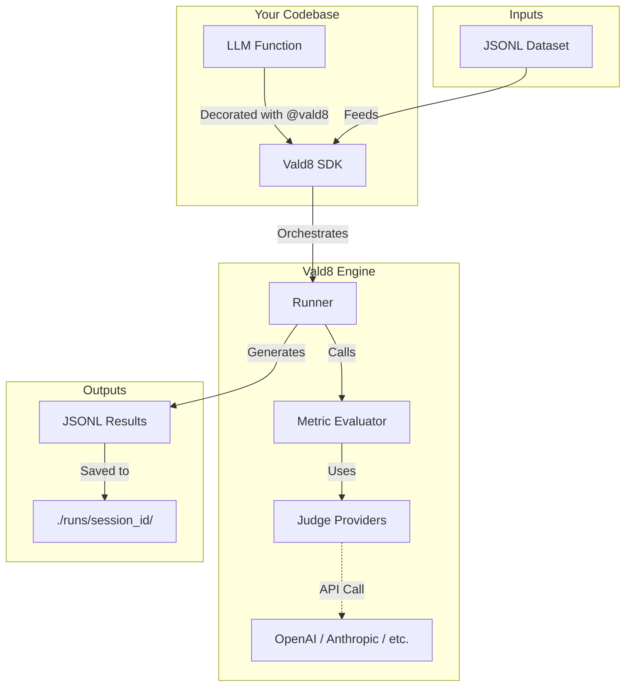

# Welcome to Vald8

**Vald8** (validate) is a minimalist, developer-first SDK for testing LLM-powered Python functions using structured JSONL datasets.

## Vision: Democratizing AI Evaluation

In the rapidly evolving landscape of Generative AI, evaluation is the new unit testing. However, existing tools are often:
*   **Too Complex**: Requiring heavy configuration, separate servers, or complex UI setups.
*   **Too Opaque**: "Black box" metrics that are hard to trust or debug.
*   **Too Rigid**: Forcing specific workflows that don't fit into existing CI/CD pipelines.

**Vald8 envisions a world where evaluating an LLM is as simple, transparent, and routine as running `pytest`.** We believe that rigorous, continuous evaluation should be accessible to every developer, not just ML engineers with specialized infrastructure.

> Vald8 is built to operationalize the [10 Principles of Human-Centered AI Design](https://www.alexthorpe.com/principles), ensuring your AI systems are explainable, predictable, and safe.

## Mission: The "Zero-Friction" Standard

Our mission is to provide the **lowest friction path** from "prototype" to "production-ready" for LLM applications.

We achieve this by adhering to three core principles:
1.  **Code-First**: Evaluation lives where your code lives. No external platforms required.
2.  **Standard-Based**: We use standard JSONL for datasets, making your data portable and universal.
3.  **Transparent**: Every metric, every judge, and every result is open for inspection.

## High-Level Architecture

Vald8 sits directly in your codebase, wrapping your LLM functions to provide instant feedback.

## Documentation

*   [**Product Philosophy**](Product-Philosophy.md): Understanding "The Vald8 Way".
*   [**Architecture Deep Dive**](Architecture-Deep-Dive.md): How it works under the hood.
*   [**Roadmap**](Roadmap.md): Where we are going.
*   [**Use Cases**](Use-Cases.md): Real-world examples.
*   [**Contribution Guidelines**](Contribution-Guidelines.md): Join the movement.

---
*Built with ❤️ by [Alex Thorpe](https://github.com/osuthorpe).*
